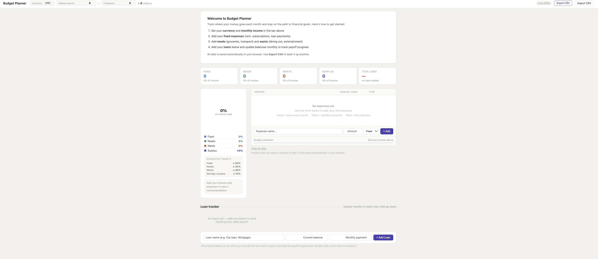

# Budget Planner — Needs vs Wants

A single-file, self-contained budget planner that runs entirely in the browser. No server, no account, no install. Just open the HTML file and start budgeting.



## Features

- **Dual income tracking** — separate fields for stable and freelance/variable income, with a live total
- **Three expense categories** — Fixed (same every month), Need (variable necessity), Want (discretionary)
- **Live donut chart** — updates as you add or reclassify expenses
- **Budget health indicator** — automatic recommendation based on your current split
- **Loan tracker** — add any loan or debt, track the remaining balance month by month, and watch a progress bar go from red to green as you pay it down
- **Balance history** — every time you update a loan balance, the date and amount are logged so you can see your payoff progress over time
- **Configurable currency** — type any code or symbol (`USD`, `EUR`, `GBP`, `RON`, `$`, `€`, ...)
- **CSV export & import** — back up your data as a plain CSV file, edit it in Excel/Sheets, and re-import it
- **Auto-save** — all data is saved automatically to browser localStorage; your data persists between sessions

## Getting started

1. Download `budget_planner_template.html`
2. Open it in any modern browser (Chrome, Firefox, Safari, Edge)
3. Set your **currency** and **monthly income** in the top bar
4. Add your expenses using the form — toggle each one between **Fixed**, **Need**, and **Want**
5. Add your loans in the Loan Tracker section and update balances each month

That's it. No configuration needed.

## How to use the loan tracker

1. Click **+ Add Loan**, enter the loan name, current balance, and monthly payment
2. The original balance is recorded on creation and used to calculate the payoff progress bar
3. Each month, click **Update balance** on a loan card and enter the new remaining balance
4. The history table logs every update with the date and the change amount (▼ = paid down, ▲ = increased)

## Export & import

**Export CSV** downloads a file like `budget_2026-06-21.csv` that looks like this:

```
# Budget Planner Export — 2026-06-21
currency,USD
stable_income,5000
freelance_income,800

# Expenses
name,amount,type
"Rent",1200,fixed
"Groceries",400,need
"Netflix",15,fixed
"Dining out",200,want

# Loans
loan_name,original_balance,current_balance,monthly_payment
"Car loan",18000,14300,350
```

**Import CSV** reads the same format back in. You can also edit the CSV in Excel or Google Sheets and re-import it — useful for bulk edits.

## Suggested budget targets

The tool flags when you exceed these thresholds:

| Category | Target |
|----------|--------|
| Fixed    | ≤ 40%  |
| Needs    | ≤ 20%  |
| Wants    | ≤ 30%  |
| Surplus  | ≥ 10%  |

If you are actively paying off debt, aim for Wants ≤ 10% and Surplus ≥ 30% and put every extra towards your highest-interest balance first.

## Editing data inline

- **Double-click** any expense name or amount to edit it in place
- **Double-click** any loan name to rename it
- Press **Enter** to confirm or **Escape** to cancel

## Tech

Pure HTML, CSS, and JavaScript. The only external dependency is [Chart.js](https://www.chartjs.org/) loaded from cdnjs. Everything else is inline — no build step, no framework, no bundler.

Data is stored in `localStorage` under the key `budget_planner_v1`. Each browser/device has its own separate storage, so use **Export CSV** to move data between devices.

## License

MIT — do whatever you want with it.
